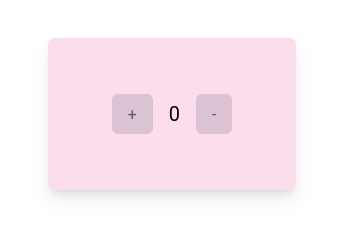

# ex_gleam_lustre_gleez



## Usage

Launch web server in current directory.
```sh
npx http-server
# or 
bunx http-server
```

## Development

```sh
gleam run   # Run the project
gleam test  # Run the tests
gleam shell # Run an Erlang shell
```
